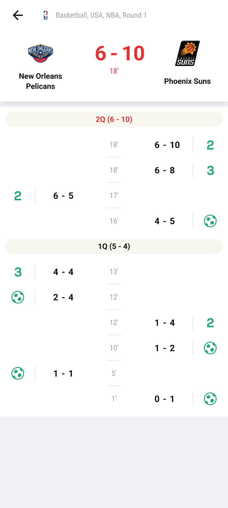

# Sofascore Final Project
Mini sofascore android app made for Sofascore Android Academy 2023

### Project Images

    
    
    
    
    
    
    
    
    
    
    

## Project Description
- Android app made similar to the original Sofascore app, it shows matches for basketball, football and Am. football by days
- Shows details for matches and standings by rounds

### API usage
- Fetching data from Sofascore backend server [Sofascore](https://academy-backend.sofascore.dev/_"Sofascore")

## How to run this project
- Run the project using Android Studio

## Technologies
- RESTful HTTP methods
- MVVM design pattern
- Datastore for storing user's preferences saved in settings
- Room Database for saving data
- Defining APIs with Retrofit interfaces
- Using LiveData in ViewModel for loading data
- Paging3 library for showing paging data
